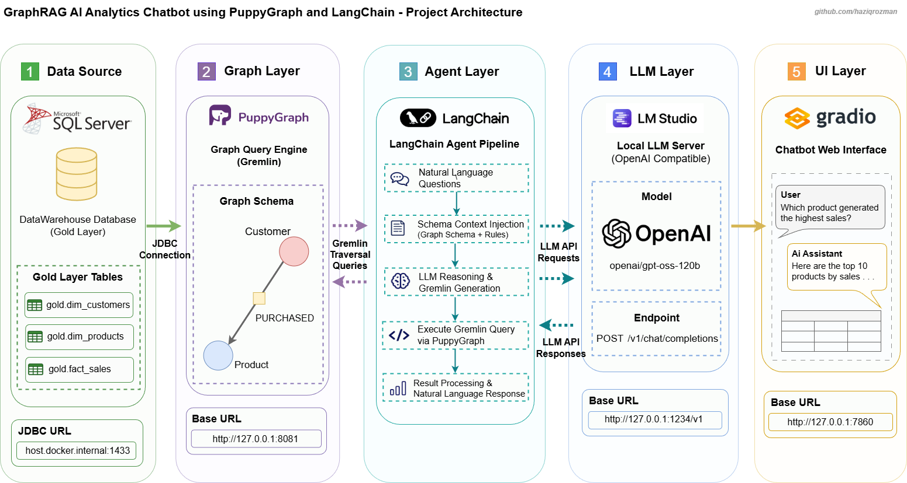
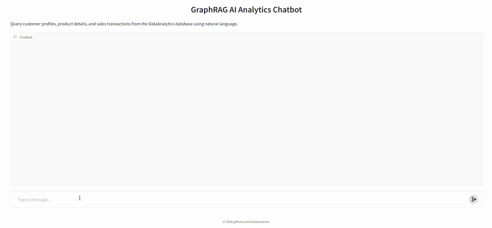
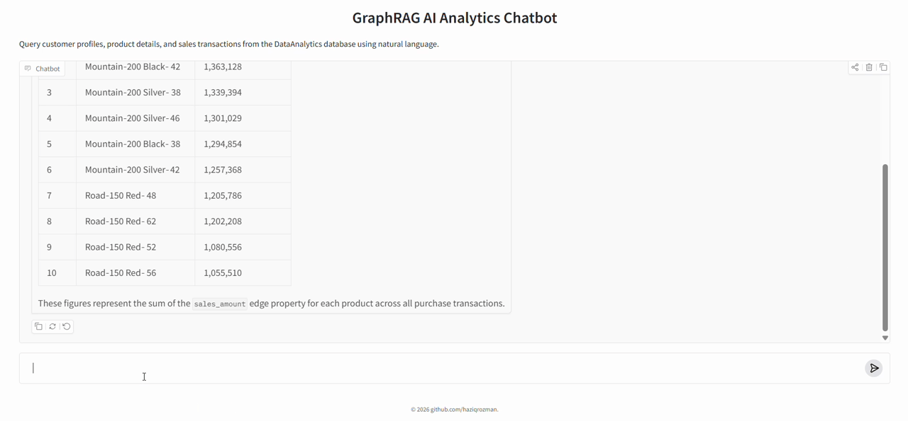
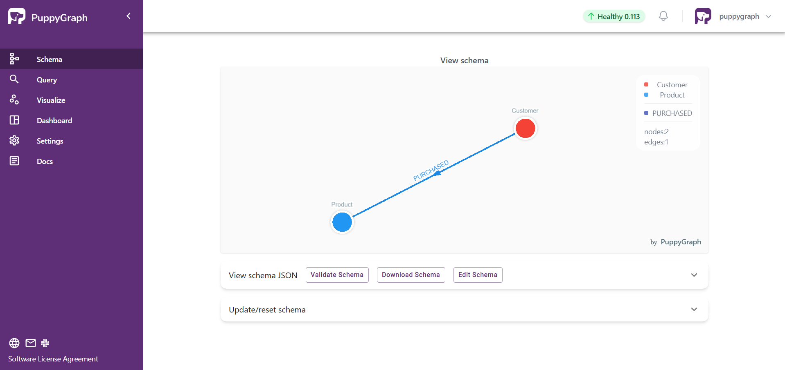
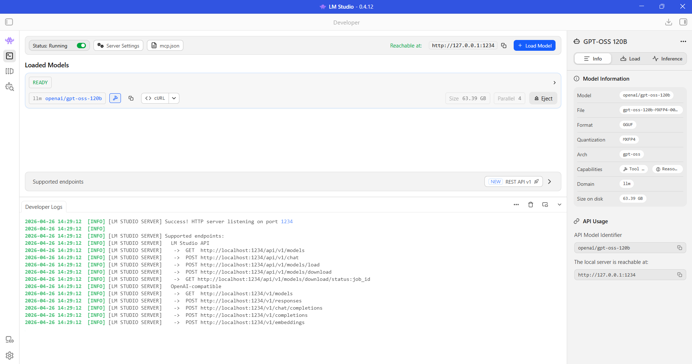

# GraphRAG AI Analytics Chatbot using PuppyGraph and LangChain

## Project Overview

A GraphRAG-powered AI chatbot that queries a graph database built on retail sales data, enabling natural language interaction over customer, product, and transaction relationships using a locally hosted LLM.

| Detail | Description |
|---|---|
| **Graph Engine** | PuppyGraph (Gremlin) |
| **Agent Framework** | LangChain |
| **LLM Serving Platform** | LM Studio |
| **LLM Model** | openai/gpt-oss-120b |
| **Web Application Interface** | Gradio |
| **Programming Language** | Python |
| **Container Runtime** | Docker |
| **Data Source** | DataWarehouse database, Gold Layer — [sql-data-warehouse-project](https://github.com/haziqrozman/sql-data-warehouse-project) |
| **Datasets** | [View Datasets](https://github.com/haziqrozman/graphrag-ai-analytics-chatbot/tree/main/01_datasets) |

---

## Project Architecture



---

## Project Demo





---

## Repository Structure

```
graphrag-ai-analytics-chatbot/
│
├── 01_datasets/                        # Source data — Gold Layer from sql-data-warehouse-project
│   ├── gold.dim_customers.csv
│   ├── gold.dim_products.csv
│   ├── gold.fact_sales.csv
│   └── 00_init_database.sql
│
├── 02_services/                        # Docker, database, and graph schema configuration
│   ├── docker-compose.yaml
│   ├── create_mssql_login.sql
│   ├── graph_schema.json
│   └── requirements.txt
│
├── 03_application/                     # LangChain agent and Gradio application
│   ├── llm.py
│   ├── puppygraph_client.py
│   ├── graph_schema_prompt.py
│   ├── agent_prompt.py
│   ├── puppygraph_agent.py
│   └── app.py
│
├── 04_docs/                            # Project documentation and visual references
│   ├── project-architecture.png
│   ├── puppygraph-schema.png
│   ├── lmstudio-server.png
│   ├── chatbot-demo-query-1.gif
│   └── chatbot-demo-query-2.gif
│
├── LICENSE
└── README.md
```

---

## Project Epics

### 0. Data Source
The analytics datasets are the Gold Layer tables from the `DataWarehouse` database, sourced from [sql-data-warehouse-project](https://github.com/haziqrozman/sql-data-warehouse-project) as the analytics-ready data source for this project.

- Initialise DataAnalytics Database & Load Gold Layer Datasets — [00_init_database.sql](https://github.com/haziqrozman/graphrag-ai-analytics-chatbot/blob/main/01_datasets/00_init_database.sql)

### 1. Deploy Services
Configure the local service stack by provisioning the PuppyGraph graph engine via Docker, establishing the SQL Server database connection, defining the property graph schema, and setting up the Python environment with all required dependencies.

- Create MSSQL Login and Assign Role for PuppyGraph JDBC connection — [create_mssql_login.sql](https://github.com/haziqrozman/graphrag-ai-analytics-chatbot/blob/main/02_services/create_mssql_login.sql)
- Deploy PuppyGraph container via Docker — [docker-compose.yaml](https://github.com/haziqrozman/graphrag-ai-analytics-chatbot/blob/main/02_services/docker-compose.yaml)
- Define PuppyGraph Graph Schema — [graph_schema.json](https://github.com/haziqrozman/graphrag-ai-analytics-chatbot/blob/main/02_services/graph_schema.json)

  

- Install LM Studio and load the LLM model locally

  

- Create Python virtual environment and install dependencies — [requirements.txt](https://github.com/haziqrozman/graphrag-ai-analytics-chatbot/blob/main/02_services/requirements.txt)

### 2. Develop Application
Build the GraphRAG agent pipeline by connecting the PuppyGraph client, LLM inference backend, graph schema prompt context, and LangChain prompt template into a single deployable chatbot web interface using Gradio.

- Configure LLM connection via LM Studio — [llm.py](https://github.com/haziqrozman/graphrag-ai-analytics-chatbot/blob/main/03_application/llm.py)
- Initialise PuppyGraph Client Connection — [puppygraph_client.py](https://github.com/haziqrozman/graphrag-ai-analytics-chatbot/blob/main/03_application/puppygraph_client.py)
- Define Graph Schema Prompt Context — [graph_schema_prompt.py](https://github.com/haziqrozman/graphrag-ai-analytics-chatbot/blob/main/03_application/graph_schema_prompt.py)
- Build LangChain Chat Prompt Template — [agent_prompt.py](https://github.com/haziqrozman/graphrag-ai-analytics-chatbot/blob/main/03_application/agent_prompt.py)
- Initialise PuppyGraph Agent — [puppygraph_agent.py](https://github.com/haziqrozman/graphrag-ai-analytics-chatbot/blob/main/03_application/puppygraph_agent.py)
- Launch Gradio Web Interface — [app.py](https://github.com/haziqrozman/graphrag-ai-analytics-chatbot/blob/main/03_application/app.py)

---

## Project Technical Scope

- Graph Schema Design — modelled `Customer` and `Product` as graph vertices with `PURCHASED` as a directed relationship, mapping Gold Layer tables into a property graph structure in PuppyGraph
- Graph Query Engine — configured PuppyGraph as the Gremlin traversal layer to execute graph queries directly over SQL Server data
- LangChain Agent Pipeline — built a `PuppyGraphAgent` with multi-turn conversation history support using `ChatPromptTemplate` and `MessagesPlaceholder`
- Prompt Engineering — injected graph schema context and traversal rules into the system prompt to constrain the LLM to schema-valid query generation
- Local LLM Integration — integrated a locally hosted LLM served via LM Studio as the inference backend for analytical responses
- Web Application Development — developed an interactive chatbot web interface using Gradio as the frontend layer

---

## Get in Touch

[](https://www.linkedin.com/in/haziqrozman/)
[](mailto:haziqrozman99@gmail.com)
